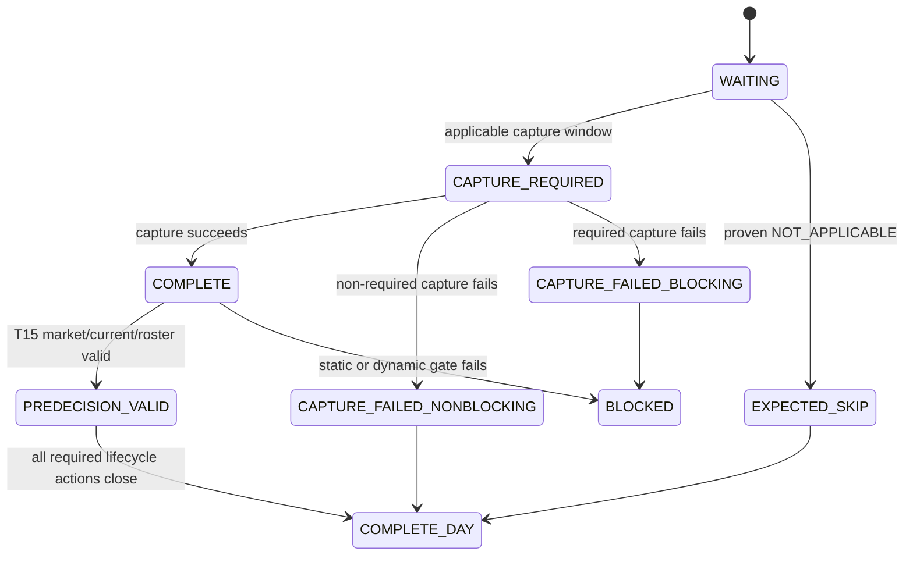

# P2 Live Operations V2 Design

## Status and scope

Status: `DESIGN_COMPLETE` (2026-08-24).  This document defines the next operational interface around the already-passing live-history, model, prediction, decision, result, and reconciliation paths.  It does not alter those paths.

The existing `USER_OPERATION_CONTRACT.md` remains the baseline contract.  This V2 document is its managed operational successor: it converts the current maintenance-oriented commands into a normal-day workflow without changing the frozen model or feature semantics.

Today’s Funabashi meeting must use the existing pipeline.  V2 implementation starts only after that day is complete.

## Normal user experience

Normal operation has two user actions.

1. Optionally place Keibabook ability/training JSON in the date inbox.
2. Run `./race-day --date YYYY-MM-DD --venue VENUE`.

The command owns prior-date history refresh, day discovery, static preflight, collection, T20/T15/T10/T05 status, eligible-race shadow inference, bundle handoff, result monitoring, official result collection, reconciliation, and recommended-strategy accounting.  The normal user must not separately invoke `live_history_update`, `prospective_day_collector`, `prospective_collection_status`, internal `race_shadow`, `live_dev_freeze_decision`, `official_result_collector`, or `live_dev_reconcile`.

When a Primary race reaches valid T15, the system emits `ANALYSIS_READY` with a one-file bundle.  The analysis layer returns only `BET` or `NO_BET`, recommended tickets, and stake per ticket.  The user then runs one `./race-decision ...` command.  Bundle hashes, model/feature references, pre-decision snapshots, and immutable prediction references are resolved internally.

Internal commands remain maintenance and diagnostic interfaces; they are not removed.

## Static and dynamic gates

Static gates are checked for every published-card race as a day-level preflight:

- race identity and Primary eligibility;
- card parsing, exact horse identity, canonical collision, and approved direct/detail, cold-start, or pedigree resolution;
- course direction, class semantics, and jockey/trainer official-ID to frozen V1 token compatibility;
- model, preprocessing, and FS04 artifact hashes/count;
- raw and normalized live-history freshness;
- Keibabook availability (reported as `CONTEXT_INCOMPLETE`, never an FS04 model blocker);
- static parser/contract warnings.

Dynamic gates are checked only when they can exist: Market T15, CURRENT T15, active roster exactness, capture timing, and `PREDECISION_VALID`.

The design rule is that static blockers must not first appear at T15.  A day preflight prints every race in one report, for example:

```
STATIC_PREFLIGHT
川崎09 PRIMARY READY
川崎10 PRIMARY READY
川崎11 PRIMARY READY
STATIC_BLOCKERS: 0
```

## Lifecycle and exit semantics

One day/race collector state machine distinguishes expected absence from operational failure.  `NOT_APPLICABLE` is unavailable until a historical/source-capability audit proves a precise semantic; it must not be inferred from a new-horse race.



Required statuses are `WAITING`, `CAPTURE_REQUIRED`, `COMPLETE`, `PREDECISION_VALID`, `EXPECTED_SKIP` / `NOT_APPLICABLE`, `CAPTURE_FAILED_NONBLOCKING`, `CAPTURE_FAILED_BLOCKING`, `BLOCKED`, and `COMPLETE_DAY`.

Primary ineligibility is a normal business outcome, not an exception:

```
SHADOW_SKIPPED
reason=PRIMARY_EXCLUDED
detail=BELOW_PRIMARY_CLASS_FLOOR_C3
action=NONE
```

CLI outcome classes and planned exit semantics are:

| Outcome | Meaning | Exit code |
|---|---|---:|
| `READY`, `WAITING`, `COMPLETE`, `SKIPPED_EXPECTED` | Normal actionable or completed business state | 0 |
| `BLOCKED_RECOVERABLE` | Valid operation cannot proceed until stated recoverable input arrives | 10 |
| `FAILED_INVARIANT` | Technical or contract failure | 20 |

The default CLI output is a compact human-readable summary: current state, target race, next action, and next relevant time.  `--json` and persisted artifacts provide structured detail.  Raw JSON must never be dumped by default.

## `race-day` orchestration contract

For one venue/day, `race-day` orchestrates, in this order where applicable:

1. previous-date history update;
2. raw and normalized freshness validation;
3. official day/card discovery;
4. all-race static preflight;
5. Primary eligibility classification;
6. collector lifecycle ownership;
7. T20/T15/T10/T05 status handling;
8. T15 `PREDECISION_VALID` validation;
9. automatic `race-shadow` only for eligible Primary races;
10. analysis bundle generation;
11. human-readable `ANALYSIS_READY` event;
12. post-race result completeness monitoring;
13. official result collection;
14. reconciliation;
15. recommended-strategy accounting.

It may collect non-Primary races for engineering/history purposes, but must not automatically infer or freeze a shadow prediction for a `PRIMARY_EXCLUDED` race.

Its output also states the next action without user-side time arithmetic, for example `NEXT ACTION: 18:50 川崎9R T15`, `NEXT PRIMARY: 9R 19:05`, and `ANALYSIS_WINDOW: 18:50–19:00`.

## Decision, freeze, and strategy accounting

`race-shadow` / `race-day` always creates an immutable-prediction-compatible decision draft/template after a valid prediction and bundle.  `race-decision` accepts only the human decision (`BET` / `NO_BET`), recommended tickets, and stake per ticket; it validates the pre-decision frozen references and creates the immutable decision.

The strategy evaluation source of truth is the pre-race frozen recommended portfolio, not the user’s actual purchase.  Decision records must carry:

- `decision_status`;
- `recommended_tickets`, ticket type, and selections;
- `stake_yen` per ticket and `total_recommended_stake_yen`;
- after official results: `recommended_payout_yen`, `recommended_profit_yen`, and `recommended_roi`.

For `NO_BET`, stake and profit are zero and ROI is `N/A`.  An `actual_bets` table may remain separate, but never supplies the primary model-strategy evaluation.

## Current-context and analysis bundle contract

The bundle must show Market, Candidate, edge, fair odds, bodyweight/change, training, ability, feature/data-quality warnings, cold-start status, source boundary, and decision deadline.  It also must show current jockey, previous jockey, and `JOCKEY_CHANGE` status.

FS04 model features and `P2_CURRENT` context remain separate.  The jockey-change work is an audited pre-race data-flow requirement, not a post-result interpretation.  The current parser must preserve raw provenance, official person ID, registered display name, parser confidence/status, and emit `CONTEXT_FIELD_UNRESOLVED` rather than a fabricated jockey value when parsing is ambiguous.  The known 2026-08-21 father/mother-to-jockey misparse is a required regression fixture.

## Result completeness

Result-page existence is not finality.  V2 introduces staged result state, with required fields derived from the frozen normalized-history consumer contract:

- `RESULT_WAITING`: no usable official result yet;
- `RESULT_PARTIAL`: page/capture exists but required model-history primitives are incomplete;
- `RESULT_MODEL_HISTORY_COMPLETE`: all primitives needed for eligible history promotion are final and complete;
- `RESULT_OFFICIAL_FINAL`: official final result contract, including the existing finality conditions, passes.

History promotion waits for `RESULT_MODEL_HISTORY_COMPLETE`.  Payout completeness is a distinct axis for recommended-strategy accounting; its availability must not be conflated with speed/pace/history primitives.

Implementation authority is now `P2_RESULT_COMPLETENESS_STATE_CONTRACT_V1`.
Race-day POST records source state, history readiness, and WIN/WIDE/TRIO payout
readiness independently.  `RESULT_MODEL_HISTORY_COMPLETE` is readiness for
the next eligible prepare cycle, never same-day history promotion.

## Retained regressions and semantic coverage

The following are done and must remain regression acceptance:

- Natural race-key reconciliation: result collection resolves `race_date + venue + race_number`, reuses the existing canonical registry key, and blocks meaningful metadata conflicts.
- Live horse identity: pre-race resolution priority remains official detail, genuine cold start, then exact approved pedigree fallback; no name-only or result-page identity path.

A bounded P1 South Kanto Main historical/source-semantic coverage audit will inventory identity annotations, affiliation prefixes, result statuses, race-type texts, and person display forms.  It is not a nationwide NAR project.  Patterns discoverable in this corpus should be addressed before a live unknown exception occurs.

## Monitoring, events, and project boundary

V2-G adds venue-level monitoring only for Ohi, Funabashi, Kawasaki, and Urawa: race count, Candidate LL, Market LL, delta LL, BET count, recommended stake, recommended P/L, and recommended ROI.  It must not create automatic venue bet/exclusion gates.

`ANALYSIS_READY`, `BLOCKING_FAILURE`, and `DAY_COMPLETE` are durable event types.  Phone delivery is a deferred P2 hook integration, not part of this V2 implementation.

Development owns models, feature/parser work, and experiments.  Operations owns fixed-version daily preflight, collection, prediction, handoff, decision, result/reconciliation, and the strategy ledger.  V2 will define a lightweight handoff package when this operational contract stabilizes; it is not a release gate.

## Implementation sequence

| Phase | Scope | Main dependencies |
|---|---|---|
| V2-A | State machine, business/technical outcomes, compact CLI/JSON UX | retained collector fixtures |
| V2-B | All-race static day preflight | identity/direction/V1-person/freshness/artifact checks |
| V2-C | `race-day` thin orchestrator around existing modules | V2-A, V2-B |
| V2-D | Decision draft/template and minimal `race-decision` | V2-C, frozen prediction/ledger |
| V2-E | CURRENT jockey parser quality and jockey-change context | V2-B bundle contract |
| V2-F | Result completeness stages and recommended-strategy accounting | V2-D, existing collector/reconcile |
| V2-G | Venue/day reporting and event hooks | V2-F; phone delivery deferred |

Each phase must wrap existing working paths rather than rewrite collectors, the fixed model, or the four FS04 blocks.

## V2 user-journey acceptance

A normal day passes only when the user can supply optional context JSON and run one `race-day` command; the system completes history, static preflight, collector ownership, Primary selection, T15 validation, prediction, and bundle generation; the user receives `ANALYSIS_READY`; and one `race-decision` command records the analysis decision.  Then result completeness, result collection, reconciliation, and frozen recommended-strategy accounting proceed without normal-user maintenance commands.
